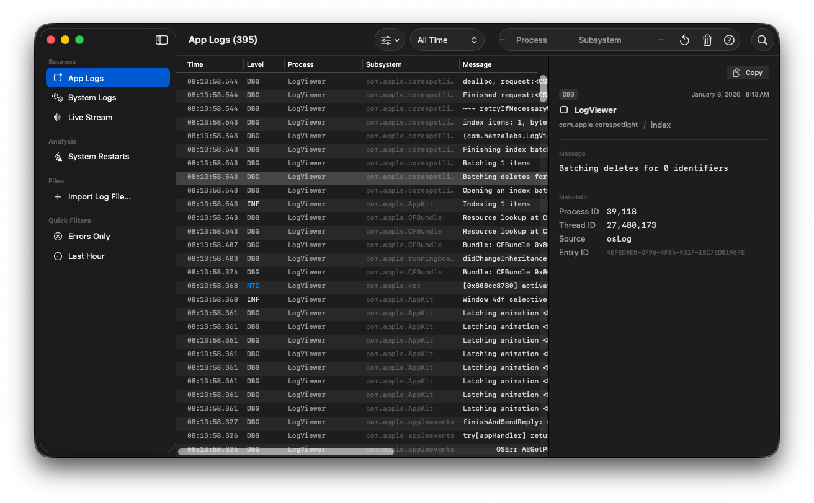
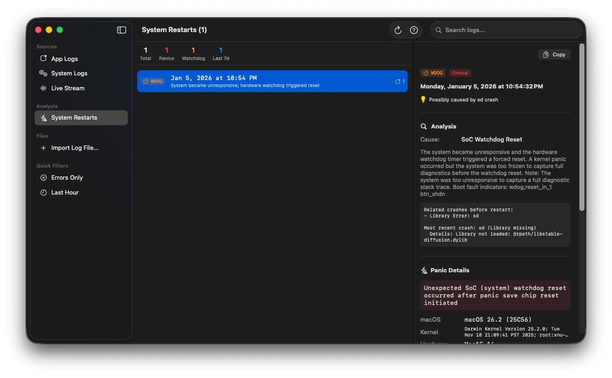

# LogViewer

A powerful macOS log viewer and system restart analyzer built with SwiftUI.

## Screenshots

### Log Viewer


### System Restart Analysis


## Features

### Log Sources
- **App Logs** - View logs from the current application
- **System Logs** - Browse all system logs (requires Full Disk Access)
- **Live Stream** - Watch logs in real-time as they're generated
- **Log Files** - Import and view external log files (.log, .txt, .json)

### System Restart Analysis
- Analyze kernel panics and unexpected system restarts
- Parse panic logs from `/Library/Logs/DiagnosticReports/`
- Correlate crashes that occurred before each panic
- View detailed panic information (SoC ID, boot faults, kernel version)
- Get recommendations based on crash patterns

### Filtering & Search
- Filter by log level (Debug, Info, Notice, Warning, Error, Fault)
- Filter by time range (Last Hour, Last 24 Hours, Last 7 Days, Today)
- Filter by process name or subsystem
- Full-text search across messages, processes, and subsystems
- Quick filters for common scenarios (Errors Only, Last Hour)

### Export
- Export logs in Plain Text, JSON, or CSV format

## Requirements

- macOS 14.0 or later
- Xcode 15.0 or later (for building)

## Permissions

LogViewer requires **Full Disk Access** to read system logs and diagnostic reports:

1. Open **System Settings** > **Privacy & Security** > **Full Disk Access**
2. Enable LogViewer

Without this permission, you can still view App Logs and imported log files.

## Building

```bash
git clone https://github.com/Hamza-Labs-Core/LogViewer.git
cd LogViewer
open LogViewer.xcodeproj
```

Build and run with Xcode (⌘R).

## Architecture

LogViewer follows Clean Architecture with MVVM:

```
LogViewer/
├── App/                    # App entry point and configuration
├── Core/
│   ├── Models/            # Domain models (LogEntry, KernelPanic, etc.)
│   └── Protocols/         # Repository protocols
├── Data/
│   └── Repositories/      # Data access implementations
├── Domain/
│   └── UseCases/          # Business logic
├── Infrastructure/
│   └── Actors/            # Swift Actors for async processing
├── Presentation/
│   ├── Components/        # Reusable UI components
│   ├── ViewModels/        # View state management
│   └── Views/             # SwiftUI views
└── Resources/             # Assets and resources
```

## Keyboard Shortcuts

| Action | Shortcut |
|--------|----------|
| Search | ⌘F |
| Copy | ⌘C |
| Clear Logs | ⌘K |
| Refresh | ⌘R |
| Help | ⌘? |
| Export | ⇧⌘E |

## Troubleshooting

### "Permission denied" errors
Enable Full Disk Access in System Settings > Privacy & Security.

### No logs showing
- Try switching to System Logs instead of App Logs
- Check if any filters are active and reset them
- Ensure the app has necessary permissions

### Live Stream not working
Click the Play button in the toolbar after selecting Live Stream.

### System Restarts empty
No kernel panics have occurred recently. The app reads from `/Library/Logs/DiagnosticReports/`.

## License

MIT License - see [LICENSE](LICENSE) for details.
